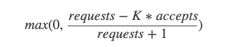

### 1. 原理

弹性熔断是根据成功率动态调整的，当成功率越高的时候，被熔断的概率就越小；反之，当成功率越低时，被熔断的概率就相应增大

客户端请求拒绝的概率：


- 降低 K 值会使自适应限流算法更加激进，恢复快（允许客户端在算法启动时拒绝更多本地请求）
- 增加 K 值会使自适应限流算法不再那么激进，恢复慢（允许服务端在算法启动时尝试接收更多的请求，与上面相反）

### 2. 使用demo实现

- NewBreaker: 初始化一个Breaker
- WithAcceptable: 可以指定允许的错误的类型，指定的错误将不加入熔断器错误的计算
- WithFallback: 可以指定回调方法，发生错误会调用这个函数
- WithBreakerType: 指定Breaker的类型，暂时就一种，即为默认Google sre算法实现
- GetOrBuild: 先从包全局变量中获取指定的breaker，如果没有则初始化，***WithXXX函数也是再次发生作用***，所以要确保这个在最后一步。
- Do: 传入一个函数即为熔断器作用的函数，在这个函数里面用户自定义操作

```go
    // complexBreaker
err := NewBreaker().
WithAcceptable(func (err error) bool {
return true
}).
WithFallback(func (err error) error {
return nil
}).
WithBreakerType(GoogleBreaker).
GetOrBuild("test-breaker").
Do(func () error {
fmt.Println(123)
return nil
})
```

```go
    // simpleBreaker
err := NewBreaker().
Do(func () error {
return nil
})
```

```go
//redis客户端初始化过程中，特意将breaker作为brk依赖注入,使得go-zero底层redis客户端组件自带熔断保护措施
// 参照这我们使用breaker的灵活性就很大了,  闭包。。
func NewRedis(redisAddr, redisType string, redisPass ...string) *Redis {
    var pass string
    for _, v := range redisPass {
        pass = v
    }

    return &Redis{
        Addr: redisAddr,
        Type: redisType,
        Pass: pass,
        brk:  breaker.NewBreaker(),//redis客户端初始化过程中，特意将breaker作为brk依赖注入
    }
}


// 这是找到go-zero的redis客户端del过程
// 看见没 s.brk.DoWithAcceptable, go-zero将所有操作redis的过程都以闭包的形式包入breker中
func (s *Redis) Del(keys ...string) (val int, err error) {
    err = s.brk.DoWithAcceptable(func() error {
        conn, err := getRedis(s)
        if err != nil {
            return err
        }

        if v, err := conn.Del(keys...).Result(); err != nil {
            return err
        } else {
            val = int(v)
            return nil
        }
    }, acceptable)

    return
}

```
### 3. 数据及熔断测试

i组测试用例
```go
for i := 0; i < 500; i++ {
    n := rand.Int31n(500)
    fmt.Printf("是否出错 %v 第%vrange：：", n > int32(i), i)
    if n < int32(i) {
        err = optBreaker.Do(test.req[0]) // 正常方法
    } else {
        err = optBreaker.Do(test.req[1])  // 出错方法
    }
}
```
i=500共执行230次错误方法，270次正确方法

刚开始错误概率比较大，模拟调用系统发生错误，随着i增大，错误渐渐减少

k = 2,
一共请求方法[成功+失败]320次，执行方法[成功]197次。
执行出错123次。熔断180次。执行完成后熔断概率为0.3-0.4

k = 1.5,
一共请求方法[成功+失败]253次，执行方法[成功]148次。
执行出错105次。熔断247次。执行完成后熔断概率为0.05-0.1

k = 1，一共请求方法[成功+失败]205次，执行方法[成功]125次。
执行出错80次。熔断295次。执行完成后熔断概率为0


相关资料：
- https://sre.google/sre-book/handling-overload/
- https://pandaychen.github.io/2020/05/10/A-GOOGLE-SRE-BREAKER/
- https://www.jianshu.com/p/218d8f3d9763
